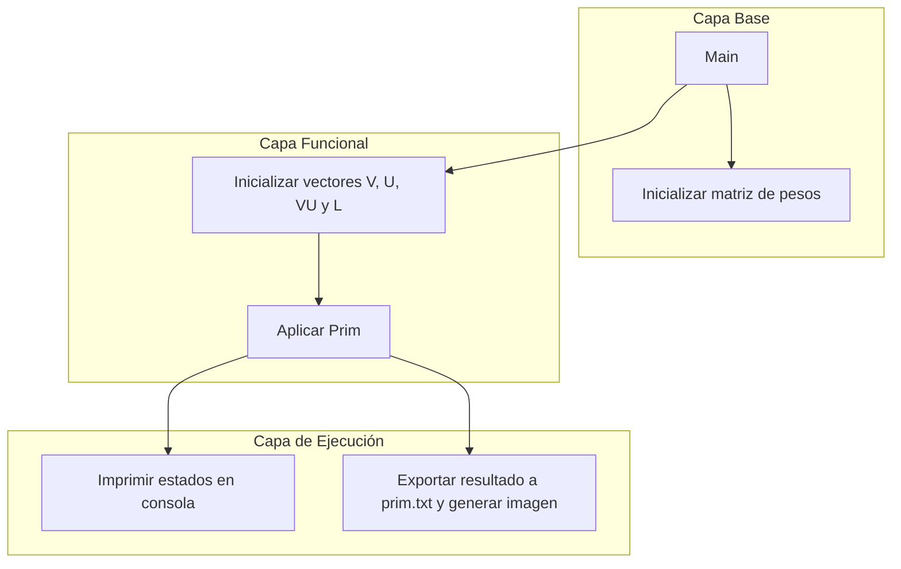

# Algoritmo de Árbol de Expansión Mínima (Prim)
### Implementación del **algoritmo de PRIM** para obtener el **Árbol de Expansión Mínima (MST)** de un grafo no dirigido y ponderado.

---

## 📘 Descripción general

Este proyecto genera un grafo simple y no dirigido mediante una matriz de adyacencia con pesos aleatorios y aplica el **algoritmo de PRIM** para obtener su **Árbol de Expansión Mínima (MST)**. Además, exporta el grafo inicial y el resultado del algoritmo para ser visulizados con **Graphviz**, permitiendo visualizar las conexiones y el costo mínimo obtenido.

A gran escala:
- Genera un grafo no dirigido aleatorio.
- Nombra nodos con etiquetas 'a', 'b', 'c', ...
- Aplica el algoritmo de PRIM.
- Exporta visualizaciones con Graphviz del grafo incicial y el resultado de costo mínimo obtenido.

---

## 🧩 Arquitectura del proyecto

```plaintext
Proyecto-Prim/
│
├── Act1_Bustamante_Esteban.cpp # Código y lógica principal + Algoritmo de Prim.
├── grafo.txt # Archivo Graphviz para grafo original.
├── grafo.png # Imagen del grafo original.
├── prim.txt # Archivo Graphviz para MST.
├── prim.png # Imagen del MST
└── README.md # Documentación del proyecto.

```
---

## 🧠 Diagrama de arquitectura de módulos



### 🔄 Descripción del flujo

1. 'Main'
-Valida argumentos de entrada (argc / argv).
-Reserva memoria dinámica para la matriz **M** y declara los vectores de caracteres **V**, **U**, **VU**, **L**.
-Llama a las funciones que componen el resto del flujo.

2. 'Inicializar matriz de pesos'
-**Inicializar_matriz_enteros** genera una matriz dinámica N x N.
-La diagonal principal contiene 0 (costo de un nodo a sí mismo).
-El grafo se trata como **no dirigido** y **sin aristas duplicadas**.
-Los pesos son aleatorios entre -1 y 7, excluyendo el 0 (**numero_aleatorio()** evita el 0). -1 indica que no hay conexión entre los nodos.

3. 'Inicializar vectores V, U, VU Y L'
-**Inicializar_vector_caracter** rellena con espacios iniciales.
-**Leer_nodos** crea nombres de nodos tipo **'a', 'b', 'c', ...** para **V** y **VU**.
-**V** contiene todos los vértices disponibles; **VU** será la lista de vértices aún por unir; **U** es el conjunto ya agregado a la solución; **L** almacena las aristas seleccionadas por Prim.

4. 'Aplicar Prim'
-**Aplicar_prim** inicia agregando **V[0]** a **U** (nodo inicial).
-Repite: busca entre todos los pares **u ∈ U** y **v ∈ VU** la arista de **menor peso positivo (ignora -1)**.
-Cuando encuentra el mejor par (u,v) lo agrega a U, registra la arista en L y remueve v de VU.
-Continúa hasta que **U contenga los N vértices**.

5. 'Exportar resultado a prim.txt y generar imagen'
-**Exportar_prim** crea **prim.txt** con formato Graphviz listando nodos y las aristas guardadas en L con sus pesos.
-Llama a **dot -Tpng prim.txt -o prim.png** para renderizar la imagen y la abre (**eog prim.png &**).
-Libera la memoria asignada a **M** con **liberar_memoria**.

---

## 📊 Representación del grafo

- Matriz de adyacencia dinámica **N x N** simétrica.
-Valores fuera de la diagonal son enteros aleatorios en **{-1, 1, 2, ..., 7}** (0 excluido).
- -1 significa **no hay conexión** entre esos vértices.

| Nodos | a | b | c |
|-------|---|---|---|
| **a** | 0 | 7 | 6 |
| **b** | 7 | 0 | 7 |
| **c** | 6 | 7 | 0 |

---

## 🧩 Funcionalidades principales

✅ Generación aleatoria de una matriz de adyacencia simétrica (grafo no dirigido).
✅ Implementación del algoritmo de Prim para obtener un Árbol Generador Mínimo (AGM).
✅ Impresión paso a paso de las comparaciones de pesos y decisiones del algoritmo.
✅ Exportación en formato Graphviz (prim.txt) y generación automática de prim.png.
✅ Gestión de memoria dinámica y liberación al final de la ejecución.

---

## ⚙️ Instalación

Requisitos mínimos:
- Compilador **g++**
- **Graphviz** instalado:
  ```bash
  sudo apt install graphviz
  ```

**Compilación**
  ```bash
  g++ Act1_Bustamante_Esteban.cpp -o Act1
  ```

**Ejecución**
  ```bash
  ./Act1 **N**
  ```
Tener a consideración que **N** debe ser un valor numérico positivo mayor a 2 que será la cantidad de vérties.

---

## 📊 Ejemplo de salida (fragmento) y 🧪 Resultado

En consola:

Fragmento del resultado:

  ```bash
    matriz[0,0]: 0 matriz[0,1]: 7 matriz[0,2]: 6
    matriz[1,0]: 7 matriz[1,1]: 0 matriz[1,2]: 7 
    matriz[2,0]: 6 matriz[2,1]: 7 matriz[2,2]: 0 

    El peso entre a y b es 7
    El peso entre a y c es 7
    ///////////////
    Se agrega b
    Se crea L -> a - b
    El peso entre a y c es 7
    El peso entre b y c es 7
    ///////////////
    Se agrega c
    Se crea L -> a - c
    (a, b)(a, c)
```

---

## 👨‍💻 Autoría

**Esteban Alfonso Bustamante Villarreal**  
Pregrado de Ingeniería Civil en Bioinformática  
**Universidad de Talca — Facultad de Ingeniería**  

---

# 📚 Referencias

- [Algoritmo de PRIM (Árbol Generador Mínimo)]
- [Documentación Graphviz]

---

> **Versión:** 1.0.0  
> **Última actualización:** Noviembre 2025  
> **Licencia:** Uso académico y educativo