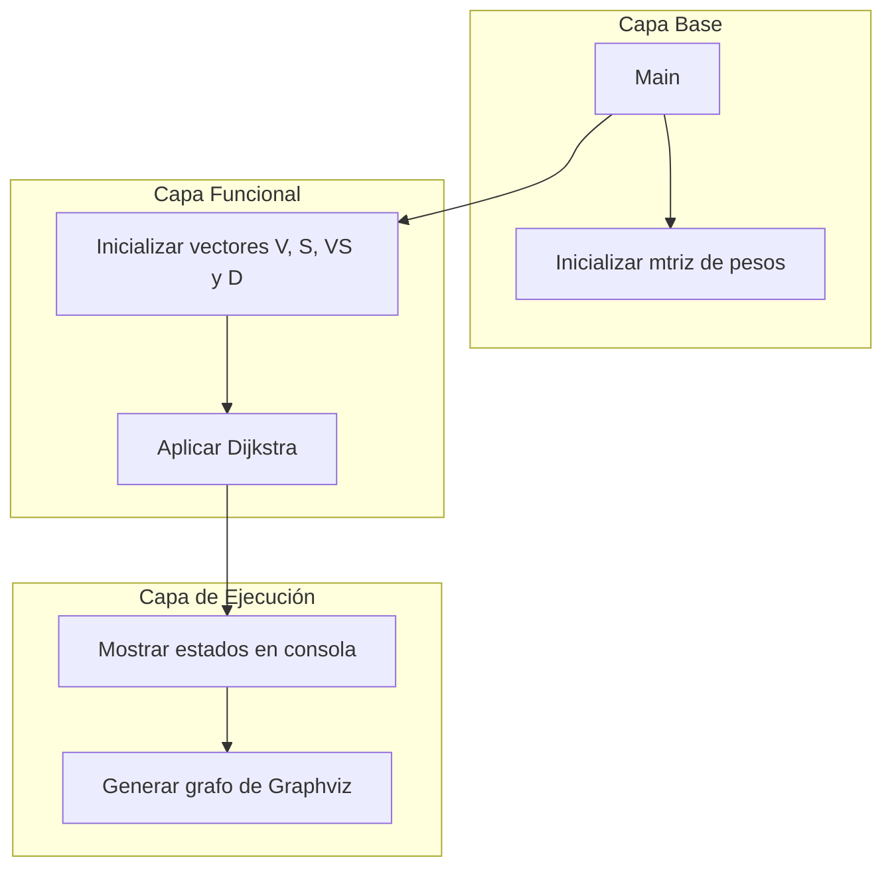

# 🧭 Dijkstra 
### Implementación del algoritmo de Dijkstra con matriz de adyacencia y visualización del grafo

---

## 📘 Descripción general

**DijkstraGraph** es una implementación del algoritmo de Dijkstra en C++, utilizando una **matriz de adyacencia** para representar el grafo y seleccionando el camino mínimo desde un nodo incial hacia los demás.

A gran escala:
- Aplica algoritmo de Dijkstra.
- Utiliza vértices con letras (a, b, c, ...).
- Registra los estados del algoritmo.
- Genera como salida un grafo visual en formato **PNG** mediante **Graphviz**.

---

## 🧩 Arquitectura del proyecto

```plaintext
Dijkstra/
│
├── Act1_Bustamante_Esteban.cpp # Código principal del algoritmo y funciones auxiliares
├── grafo.txt # Archivo generado con estructura del grafo (Graphviz)
├── grafo.png # Grafo visual exportado
└── README.md # Documentación del proyecto.

```
---

## 🧠 Diagrama de arquitectura de módulos


### 🔄 Descripción del flujo

1. `Main` Se define el tamaño de **N**.
Se reserva memoria para la matriz y los vectores.
Se llama a las funciones del resto del flujo.

2. `Inicializa matriz de pesos` Se genera matriz **dinámica NxN** que representa los pesos de un grafo.
Los valores son aleaotrios entre **-1** y **5** excluyendo el **0**.
Se garantiza que existe **un único 0 por cada fila y columna**, representando el nodo consigo mismo (distancia 0).

3. `Inicializar vectores V, S, VS y D` Estos vectores se configuran antes de iniciar el algoritmo.
**V[S]**: lisa de vértices
**S[]**: indica si el vértice ya fue seleccionado por Dijkstra
**VS[]**: almacena el conjunto de vértices solucionados
**D[]**: almacena las **distancias mínimas calculadas**

4. `Aplicar Dijkstra` Se ejecuta el algoritmo de Dijkstra para encontrar las **distancias maás cosrtas** desde el vértice inicial hacia todos los demás:
- Se analiza la matriz de pesos
- Se actualizan los mínimos temporales en **D[]**
- Se marca el sigueinte nodo seleccionado en **S[]** y se agrega a **VS[]**
- Se repite hasta calcular todas las rutas óptimas

5. `Mostrar estados en consolas` El programa imprime:
- Estados intermedios de las distancias
- Valores de los vectores **S**, **VS** y **D**
- La **matriz de adyacencia** formateada para su análisis
Permite verificar paso a paso el avance del algoritmo.

6. `Generar grafo con Graphviz` Finalmente:
- Se genera un archivo **.dot**
- El contenido describe los vértices y sus conexiones con pesos
- Puede renderizarse con Graphviz para visualizar el grafo resultante:
  ```bash
  dot -Tpng grafo.dot -o grafo.png
  ```

---

## 📊 Representación del grafo

- Matriz de adyacencia dinámica **N x N **
- Solo un **0 por fila y columna** en la diagonal principal. El resto de pesos son aleatorios entre **-1** y **5**, excluyendo el **0**
- **-1** significa **no hay conexión**

| Nodos | a | b | c | d | e |
|-------|---|---|---|---|---|
| **a** | 0 | 1 | -1 | 2 | -1 |
| **b** | 4 | 0 | -1 | 5 | -1 |
| **c** | -1 | 5 | 0 | 2 | -1 |
| **d** | 3 | 2 | -1 | 0 | -1 |
| **e** | 5 | -1 | -1 | 4 | 0 |

---

## 🧩 Funcionalidades principales

✅ Generación aleatoria del grafo
✅ Implementación completa del algoritmo de Dijkstra 
✅ Impresión de estados intermedios del algoritmo
✅ Exportación del grafo visual mediante **Graphviz**
✅ Gestión de vértices explorados (**S**) y no explorados (**VS**)
---

## ⚙️ Instalación

Requisitos mínimos:
- Compilador **g++**
- **Graphviz** instalado:
  ```bash
  sudo apt install graphviz
  ```

**Compilación**
  ```bash
  g++ Act1_Bustamante_Esteban.cpp -o Act1
  ```

**Ejecución**
  ```bash
  ./Act1 **N**
  ```
Tener a consideración que **N** debe ser un valor numérico positivo mayor a 2 que será la cantidad de vérties.

---

## 📊 Ejemplo de salida (fragmento)

En consola:
- Estados iniciales
- Elección del siguiente vértice mínimo
- Actualización D[] tras cada paso

En archivos:
- **grafo.txt** -> estructura del grafo (**Graphviz**)
- **grafo.png** -> imagen del grafo generada

Fragmento del resultado:

  ```bash
    ------------ Estados iniciales ------------
    matriz[0,0]: 0 matriz[0,1]: 3 matriz[0,2]: 4 matriz[0,3]: 1 
    matriz[1,0]: 3 matriz[1,1]: 0 matriz[1,2]: 1 matriz[1,3]: -1 
    matriz[2,0]: 6 matriz[2,1]: 2 matriz[2,2]: 0 matriz[2,3]: 5 
    matriz[3,0]: 3 matriz[3,1]: 1 matriz[3,2]: 7 matriz[3,3]: 0 

    S[0]:   S[1]:   S[2]:   S[3]:   
    VS[0]:   VS[1]:   VS[2]:   VS[3]:   
    D[0]: 0 D[1]: 3 D[2]: 4 D[3]: 1

    vertice elegido: d
    ...
```

---

## 🧪 Resultado esperado

Resultado de ejemplo de una ejecución donde el valor **N** ingresado fué 4, es decir, se escogió la ruta más corta entre 4 vértices conectados entre sí de forma aleaotria.

```bash
    Elige el vértice menor en VS[] según valores en D[]
    Lo agrega a S[] y actualiza VS[]

    vertice elegido: c
    S[0]: a S[1]: d S[2]: b S[3]: c 
    VS[0]:   VS[1]:   VS[2]:   VS[3]:   

    Actualizando pesos en D[]
    D[0]: 0 D[1]: 2 D[2]: 3 D[3]: 1 

```
- Finalmente, en la última iteración, se escoge el vértice **c**. Es añadido a **S[]** (el recorrido) -> a, d, b, c.
- En **VS[]** vacío se comprueba que todos los vértices fueron añadidos al recorrido en **S[]**.
- Los pesos actualizados en **D[]** se evalúan en cada iteración.
---

## 👨‍💻 Autoría

**Esteban Alfonso Bustamante Villarreal**  
Pregrado de Ingeniería Civil en Bioinformática  
**Universidad de Talca — Facultad de Ingeniería**  

---

# 📚 Referencias

- [Algoritmo Dijkstra]
- [Documentación Graphviz]

---

> **Versión:** 1.0.0  
> **Última actualización:** Noviembre 2025  
> **Licencia:** Uso académico y educativo